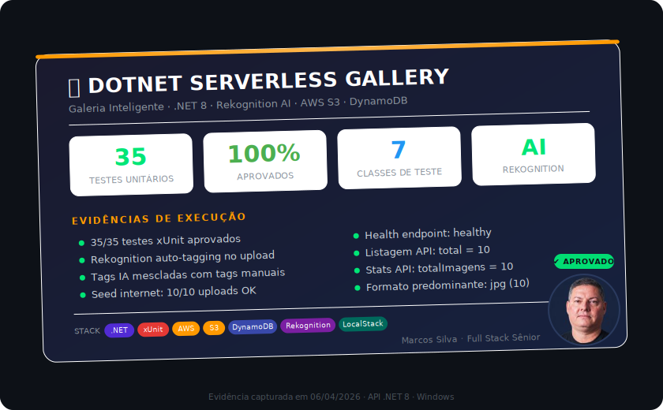

# 🖼️ Dotnet Serverless Gallery

> **A única galeria serverless construída com .NET 8 + AWS Lambda + auto-tagging por IA.**
> Galeria inteligente com classificação automática de imagens via Amazon Rekognition.


---

## 🎯 Por Que Este Projeto é Diferente

A maioria dos projetos de galeria AWS no GitHub usa **Python ou JavaScript**. Este é o **único** construído com **.NET 8 rodando nativamente dentro do AWS Lambda** — provando que .NET é cidadão de primeira classe em workloads serverless.

| Funcionalidade | Este Projeto | Projetos Típicos |
|---------|:---:|:---:|
| .NET 8 no Lambda | ✅ | ❌ Python/JS |
| Auto-tagging por IA (Rekognition) | ✅ | ❌ Tags manuais |
| Client desktop nativo (MAUI) | ✅ | ❌ Somente Web |
| Ambiente local com LocalStack | ✅ | ⚠️ Raro |
| AWS SAM (IaC) | ✅ | ⚠️ Terraform/CDK |
| Scripts de evidência automáticos | ✅ | ❌ |
| 100% AWS Free Tier | ✅ | ⚠️ Varia |

---

## 🧠 Como Funciona o Auto-Tagging com IA

Ao fazer upload de uma imagem, o fluxo é:

```
Imagem → S3 Upload → Rekognition DetectLabels → Tags IA + Tags Manuais → DynamoDB
```

1. A imagem é enviada para o **S3** com criptografia AES-256
2. O **Amazon Rekognition** analisa a imagem e detecta objetos, cenas e conceitos (ex: `landscape`, `mountain`, `sky`, `nature`)
3. As **tags de IA** são mescladas com tags manuais do usuário (sem duplicatas)
4. Tudo é salvo no **DynamoDB** — a busca por tag funciona com tags manuais **e** geradas por IA

> O Rekognition é **gratuito** para até 5.000 análises/mês no Free Tier.

---

## 📋 Funcionalidades

| Funcionalidade | Endpoint | Descrição |
|---------------|----------|-----------|
| 📤 Upload + IA | `POST /api/imagens` | Upload para S3 + auto-tagging Rekognition + DynamoDB |
| 📋 Listar | `GET /api/imagens` | Lista imagens com paginação |
| 🔍 Buscar | `GET /api/imagens/busca` | Busca por tag (manual ou IA) ou título |
| 📄 Detalhes | `GET /api/imagens/{id}` | URL assinada + metadados + tags IA |
| 🗑️ Deletar | `DELETE /api/imagens/{id}` | Remove do S3 e DynamoDB |
| 📊 Estatísticas | `GET /api/imagens/stats` | Total, formatos, tags populares |
| 🏥 Health | `GET /health` | Health check da API |

---

## 🏗️ Arquitetura

```
┌─────────────────┐       ┌───────────────────────────────────────────────┐
│  .NET MAUI App  │       │               AWS Cloud                      │
│    (Desktop)    │       │                                               │
│                 │  HTTP │  ┌──────────┐    ┌──────────────┐             │
│  ┌───────────┐  │──────►│  │   API    │───►│   Lambda     │             │
│  │ Galeria   │  │       │  │ Gateway  │    │  (.NET 8)    │             │
│  │ Upload    │  │◄──────│  │ (HTTP)   │◄───│  Minimal API │             │
│  │ Busca IA  │  │       │  └──────────┘    └──┬───┬───┬───┘             │
│  └───────────┘  │       │                ┌────┘   │   └────┐            │
└─────────────────┘       │           ┌────┴──┐ ┌───┴────┐ ┌─┴──────────┐ │
                          │           │  S3   │ │DynamoDB│ │Rekognition │ │
                          │           │(AES)  │ │(metada)│ │  (IA/ML)   │ │
                          │           └───────┘ └────────┘ └────────────┘ │
                          └───────────────────────────────────────────────┘
```

---

## 🛠️ Stack Tecnológica

| Camada | Tecnologia | Por que .NET? |
|--------|-----------|---------------|
| **API** | ASP.NET Core 8 Minimal API | Cold start ~1.5s no Lambda, tipagem forte, DI nativo |
| **Runtime** | AWS Lambda (dotnet8) | Runtime gerenciado, pague por uso, auto-scaling |
| **IA/ML** | Amazon Rekognition | Auto-tagging sem treinar modelo, Free Tier generoso |
| **Storage** | Amazon S3 | SSE-AES256, versionamento, regras de ciclo de vida |
| **Database** | Amazon DynamoDB | PAY_PER_REQUEST, GSI, latência de milissegundos |
| **Desktop** | .NET MAUI 10 | Cross-platform nativo (Win/macOS/iOS/Android) |
| **IaC** | AWS SAM (CloudFormation) | Template declarativo, deploy reproduzível |
| **Testes** | xUnit 2.9 | 35 testes, 7 classes, 100% aprovados |
| **Dev Local** | LocalStack | Emulação de S3 + DynamoDB, custo zero |

### Por que .NET no Lambda?

A comunidade AWS é dominada por Python e JavaScript. Escolher **.NET 8** demonstra:

- **Versatilidade** — O mesmo ecossistema roda API serverless, desktop nativo (MAUI) e testes
- **Performance** — O runtime `dotnet8` no Lambda é otimizado pela AWS com cold start competitivo
- **Pronto para empresas** — Tipagem forte, DI nativo, pipeline de middleware, SDK oficial da AWS
- **Nicho valioso** — Pouquíssimos projetos de referência existem combinando .NET + Lambda + Rekognition

---

## 💰 Custo AWS — 100% Free Tier

| Recurso | Free Tier | Uso Estimado |
|---------|-----------|--------------|
| Lambda | 1M requests/mês | < 10k requests |
| API Gateway | 1M chamadas HTTP API/mês | < 10k chamadas |
| S3 | 5 GB + 20k GET + 2k PUT | < 1 GB |
| DynamoDB | 25 GB + 25 RCU + 25 WCU | < 100 MB |
| Rekognition | 5.000 DetectLabels/mês | < 500 análises |
| **Total** | **$0.00/mês** | ✅ |

---

## ⚙️ Como Executar

### Pré-requisitos

- [.NET 8 SDK](https://dotnet.microsoft.com/)
- [.NET 10 SDK](https://dotnet.microsoft.com/) (para o client MAUI)
- [Docker Desktop](https://www.docker.com/) (para LocalStack)
- [AWS SAM CLI](https://docs.aws.amazon.com/serverless-application-model/) (para deploy)

### Desenvolvimento Local (LocalStack)

```bash
# 1. Subir LocalStack (emula S3 + DynamoDB)
docker run -d -p 4566:4566 localstack/localstack

# 2. Executar a API
cd src/SmartGallery.Api
dotnet run --urls "http://localhost:5050"
```

> **Nota:** O Rekognition não está disponível no LocalStack. Em ambiente local, o upload funciona normalmente — as tags de IA simplesmente não são geradas (graceful degradation).

### Deploy na AWS

```bash
cd infra
sam build
sam deploy --guided
```

### ⚡ Testar a API Deployada (sem instalar nada)

A API já está rodando na AWS:

```powershell
# Health check
Invoke-RestMethod https://klgigkovh8.execute-api.us-east-1.amazonaws.com/prod/health

# Listar imagens
Invoke-RestMethod https://klgigkovh8.execute-api.us-east-1.amazonaws.com/prod/api/imagens

# Estatísticas da galeria
Invoke-RestMethod https://klgigkovh8.execute-api.us-east-1.amazonaws.com/prod/api/imagens/stats
```

### Carga de Dados Demo

```powershell
# Baixa 10 imagens públicas e envia para a API (com auto-tagging IA)
$API = "https://klgigkovh8.execute-api.us-east-1.amazonaws.com/prod"
./Scripts/Seed-DemoData.ps1 -ApiUrl $API

# Gerar snapshot de evidências
./Scripts/Export-GallerySnapshot.ps1 -ApiUrl $API
```

---

## 📁 Estrutura do Projeto

```
dotnet-serverless-gallery/
├── src/
│   ├── SmartGallery.Api/              # ASP.NET Core 8 Minimal API
│   │   ├── Config/AwsConfig.cs        # Configuração AWS
│   │   ├── Services/
│   │   │   ├── S3Service.cs           # Upload, delete, pre-signed URL
│   │   │   ├── DynamoDbService.cs     # CRUD DynamoDB
│   │   │   └── RekognitionService.cs  # IA: auto-tagging de imagens
│   │   └── Program.cs                # 7 endpoints + DI + AWS SDK
│   ├── SmartGallery.Shared/           # Models e DTOs compartilhados
│   └── SmartGallery.Maui/            # .NET MAUI Desktop Client
├── tests/
│   └── SmartGallery.Tests/            # 35 testes xUnit (7 classes)
├── infra/
│   └── template.yaml                 # AWS SAM (Lambda + S3 + DynamoDB + Rekognition + IAM)
├── Scripts/
│   ├── Run-Evidence.ps1               # Coleta automatizada de evidências
│   ├── Seed-DemoData.ps1              # Seed com 10 imagens da internet
│   └── Export-GallerySnapshot.ps1     # Snapshot de evidências
└── README.md
```

---

## 🧪 Testes Unitários

| Métrica | Resultado |
|---------|----------|
| **Framework** | xUnit 2.9.3 |
| **Total de Testes** | 35 |
| **Aprovados** | 35 ✅ |
| **Reprovados** | 0 |
| **Classes de Teste** | 7 |
| **Cobertura** | Modelos, DTOs, Config, Validação, Tags IA |

**Classes testadas:**
- `ImagemMetadataTests` — GUID único, defaults, propriedades, tags, data UTC
- `AwsConfigTests` — Defaults, seção, customização, LocalStack URL
- `SmartGalleryDtoTests` — Records: Upload (com TagsIa), Detalhe, Resumo, Listagem, Busca
- `ValidacaoImagemTests` — Formatos permitidos/rejeitados, limites de tamanho
- `RekognitionTagTests` — Mesclagem de tags IA + manuais, normalização, deduplicação

```bash
dotnet test --verbosity normal
# Test summary: total: 35; failed: 0; succeeded: 35; skipped: 0
```

---

## 🔐 Segurança

- **S3**: Bucket privado, acesso apenas via pre-signed URLs com expiração
- **Criptografia**: Server-Side Encryption (AES-256) em todas as imagens
- **IAM**: Mínimo privilégio — Lambda acessa apenas bucket, tabela e Rekognition (somente detecção)
- **Rekognition**: Política `RekognitionDetectOnlyPolicy` — somente leitura, sem acesso a dados
- **Validação**: Tipos de arquivo (jpg/png/webp/gif) e tamanho (máx 10MB)
- **DynamoDB**: PAY_PER_REQUEST evita DDoS de custo
- **Degradação graceful**: Se Rekognition falhar, o upload continua sem tags IA
- **Privacidade/LGPD**: diretrizes operacionais em `docs/PRIVACIDADE_E_LGPD.md`

---

## 📸 Evidências de Build e Infraestrutura

<div align="center">

<picture>
  <source media="(prefers-color-scheme: dark)" srcset="docs/evidencia-card.svg">
  <source media="(prefers-color-scheme: light)" srcset="docs/evidencia-card.svg">
  
</picture>

</div>

<details>
<summary><strong>📋 Detalhes do build e recursos AWS</strong></summary>

### Build da Solution (4 projetos, 0 erros)

| Projeto | Target | Status |
|---------|--------|--------|
| SmartGallery.Shared | net8.0 | ✅ |
| SmartGallery.Api | net8.0 | ✅ |
| SmartGallery.Maui | net10.0-windows | ✅ |
| SmartGallery.Tests | net8.0 | ✅ |

### Recursos AWS no SAM Template

| Recurso | Tipo | Configuração |
|---------|------|-------------|
| S3 Bucket | Storage | SSE-AES256 · Versioning · Private |
| DynamoDB | NoSQL | PAY_PER_REQUEST · GSI por UsuarioId-DataUpload |
| Lambda | Compute | .NET 8 · 256MB · 30s timeout |
| API Gateway | HTTP API v2 | CORS · Proxy para Lambda |
| IAM Role | Security | S3 CRUD + DynamoDB CRUD + Rekognition Detect |
| Rekognition | IA/ML | DetectLabels · Auto-tagging |

</details>

---

## 🚀 Conceitos AWS Demonstrados

| Serviço AWS | Conceito | Implementação |
|-------------|----------|---------------|
| **Lambda** | Computação Serverless | ASP.NET Core 8 hospedado como função Lambda |
| **Rekognition** | Visão Computacional | Auto-tagging de imagens com DetectLabels |
| **API Gateway** | HTTP API (v2) | Proxy para Lambda com CORS |
| **S3** | Armazenamento de Objetos | SSE-AES256, versionamento, regras de ciclo de vida |
| **DynamoDB** | Banco NoSQL | Partition Key, GSI, PAY_PER_REQUEST |
| **IAM** | Mínimo Privilégio | Políticas mínimas (S3 + DynamoDB + Rekognition detect) |
| **SAM** | Infraestrutura como Código | CloudFormation completo |
| **URLs Pré-assinadas** | Acesso temporário S3 | URLs com expiração de 60 min |

---

## 📱 Cliente Cross-Platform

> Este projeto possui um **client .NET MAUI** que consome esta API:

| Repositório | Stack | Funcionalidades |
|---|---|---|
| [**smart-gallery-maui**](https://github.com/masilvaarcs/smart-gallery-maui) | .NET MAUI 10 · MVVM · CommunityToolkit | Galeria, Upload com IA, Dashboard, 4 plataformas |

---

## 👨‍💻 Autor

<div align="center">

**Marcos Santos da Silva** — Desenvolvedor Full Stack Sênior

[](https://masilvaarcs.github.io/portfolio-hub/)
[](https://www.linkedin.com/in/marcosprogramador/)
[](https://github.com/masilvaarcs)

</div>
